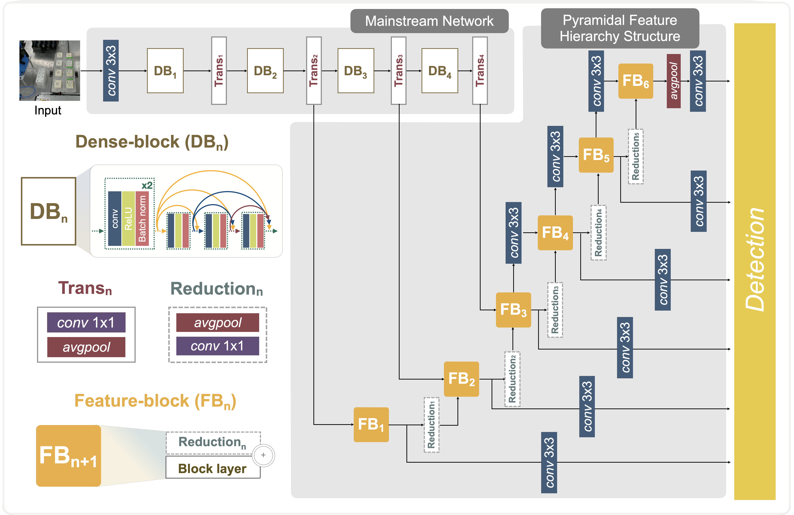

# Machine vision for vial-positioning detections towards safe automation of material synthesis


## Introduction
<p align="center">
  
</p>

This repository contains an DenseSSD that predicts vial-positioning detection using object detection techniques. DenseSSD can play vital roles in addressing these safety issues as well as can alert to user's messenger to notify and fix safety issues ASAP.

<p align="center">
  
</p>

## Requirements
  1) [PyTorch](https://pytorch.org/)
  2) [PIL](https://pillow.readthedocs.io/en/stable/installation.html)
  3) [NatSort](https://pypi.org/project/natsort/)
  4) [OpenCV](https://pypi.org/project/opencv-python/)

## Pre-trained Model
Please ensure that after unzipping the pre-trained folder and set up the directories as follows:
```
Vial-positioning
├── dataset
│   └── test_sample
├── model
│   └── denseSSD.py
├── pre-trained
│   └── model.pth
├── utils
│   └── utils.py
├── config.py
└── detect.py
```

## Test code

We also provide the codes as follows:
  1) DenseSSD architecture (see [denseSSD.py](https://github.com/KIST-CSRC/DenseSSD/tree/master/model))
  2) Test code (see [detect.py](https://github.com/KIST-CSRC/DenseSSD/tree/main/detect.py))

## Compatibility
We tested the codes with:
  1) PyTorch 1.7.0 under Ubuntu OS 16.04/18.04 LTS and Anaconda3 (Python 3.7)
  2) PyTorch 1.7.0 under Windows 10 and Anaconda3 (Python 3.7)

## Reference
Please cite us if you are using our model in your research work: <br />

  [1] Leslie Ching Ow Tiong, Hyuk Jun Yoo, Na Yeon Kim, Kwan-Young Lee, Sang Soo Han, and Donghun Kim, “Machine vision for vial positioning detection toward the safe automation of material synthesis”, *arXiv*, 2022; (see [link](https://arxiv.org/abs/2206.07272)).
