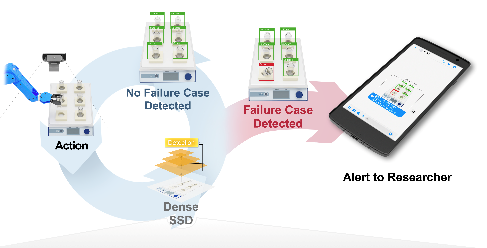
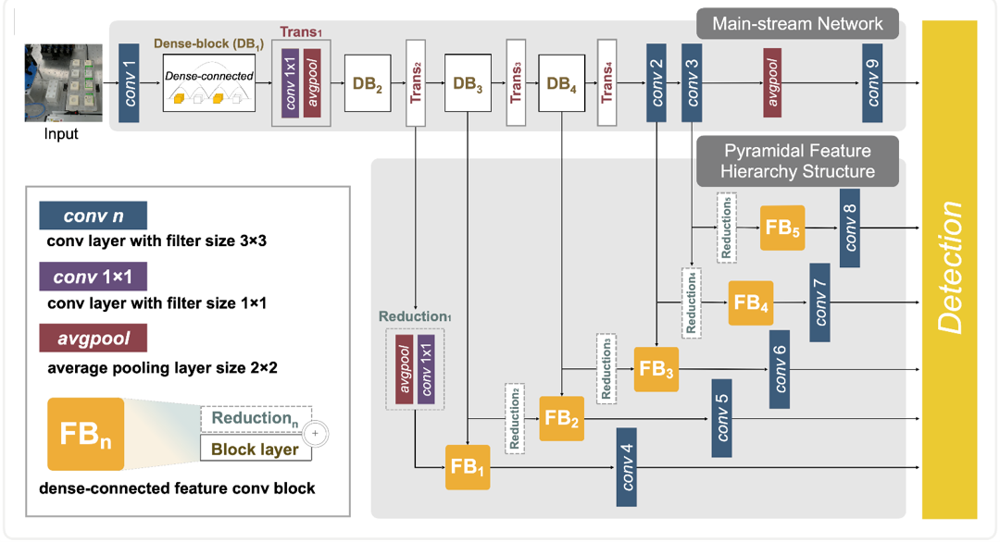

# Machine vision for vial-positioning detections towards safe automation of material synthesis


## Introduction



This repository contains an DenseSSD that predicts vial-positioning detection using object detection techniques. DenseSSD can play vital roles in addressing these safety issues as well as can alert to user's messenger to notify and fix safety issues ASAP. For more details, please refer to the following publication: `add later`



We also provide the codes as follows:
  1) DenseSSD architecture (see [denseSSD.py](https://github.com/KIST-CSRC/DenseSSD/tree/master/model))
  2) Test code (see [detect.py](https://github.com/KIST-CSRC/DenseSSD/tree/main/detect.py))


## Requirements
  1) [PyTorch](https://pytorch.org/)
  2) [PIL](https://pillow.readthedocs.io/en/stable/installation.html)
  3) [NatSort](https://pypi.org/project/natsort/)
  4) [OpenCV](https://pypi.org/project/opencv-python/)


## Pre-trained Model
Please ensure that after unzipping the pre-trained folder and set up the directories as follows:
```
Vial-positioning
├── dataset
│   └── test_sample
├── model
│   └── denseSSD.py
├── pre-trained
│   └── model.pth
├── utils
│   └── utils.py
├── config.py
└── detect.py
```


## Compatibility
We tested the codes with:
  1) PyTorch 1.7.0 under Ubuntu OS 16.04/18.04 LTS and Anaconda3 (Python 3.7)
  2) PyTorch 1.7.0 under Windows 10 and Anaconda3 (Python 3.7)


## Reference

`add later`
